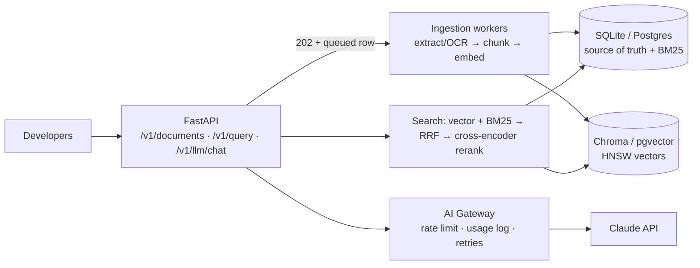

# Internal AI Knowledge Platform

A backend where internal developers can **upload documents and code**, search them in
**natural language**, **delete** them safely, and reach LLMs through a **centralized AI
Gateway**. It's built as a production-shaped RAG service: async ingestion with retries,
structure-aware chunking, hybrid retrieval with reranking, and a relational source of
truth with a derived vector index.

| Deliverable | Where |
|---|---|
| System architecture diagram | [docs/architecture.md](docs/architecture.md) |
| API design / specification | [docs/api_spec.md](docs/api_spec.md) (+ live Swagger at `/docs`) |
| Database schema design | [docs/database_schema.md](docs/database_schema.md) |
| Scaling strategy, assumptions, trade-offs | [docs/scaling_and_tradeoffs.md](docs/scaling_and_tradeoffs.md) |
| Proof of execution on the two task files | [docs/demo_output.md](docs/demo_output.md) (generated by `scripts/demo.py` through the HTTP API) |

## Architecture at a glance



## How each requirement is met

**Upload (`POST /v1/documents`)**: accepts PDF, markdown, text and 20+ code file types.
Returns **202** right away. A durable DB-backed worker then extracts, chunks, embeds and
stores. Uploads are validated (type, size, PDF magic bytes) and de-duplicated by
SHA-256. Status is polled with `GET /v1/documents/{id}`.

- **Extraction**: PDF text layer via PyMuPDF. **OCR fallback** (RapidOCR) for pages
  without one, with layout-block grouping and a high-DPI re-read of low-confidence lines.
  Repeated headers and footers are stripped.
- **Chunking**: Python by AST (one chunk per function or method, class overviews,
  leading comments kept, line numbers preserved). Markdown by heading path. PDFs and text
  by a recursive paragraph → sentence splitter (~350 tokens, 50 overlap) with page ranges.
- **Embeddings**: `BAAI/bge-small-en-v1.5` (local, 384-d, normalized). Each chunk is
  embedded with a small context header (file, symbol or heading).
- **Metadata**: typed columns + normalized tags + free-form JSON metadata. Embedding
  model and collection are tracked per chunk.

**Query (`POST /v1/query`)**: embeds the query, runs **HNSW vector search and BM25
keyword search** in parallel paths, fuses them with **Reciprocal Rank Fusion**,
**reranks with a cross-encoder**, and returns ranked top-K results with per-retriever
score breakdowns and citations (page or line range). **Metadata filters** (file type,
language, tags, custom metadata, uploader, dates, document IDs) are pushed down before
retrieval. `generate_answer: true` adds a grounded, cited answer from Claude through the
gateway.

**Delete (`DELETE /v1/documents/{id}`)**: **soft delete first**: one atomic update
hides the document from all reads immediately. **Then a hard purge** of vectors,
chunks, embeddings, keyword index, tags, row and file. Each purge step is idempotent. On
**partial failure** (e.g. vector store down) the document stays hidden and the purge is
retried with backoff (see the tests). `?hard=true` purges synchronously.

**AI Gateway (`POST /v1/llm/chat`)**: single entry point to Claude (`claude-opus-5`),
with a model allow-list, per-user rate limiting, SDK retries, refusal fallbacks,
timeouts, and per-call token usage logging.

## Results on the two task files

Full transcript: [docs/demo_output.md](docs/demo_output.md). Highlights:

| | |
|---|---|
| `Source_Code_Sample.py` | `ready` in ~9 s → 15 chunks (one per method/function + class overviews + module code) |
| `Knowledge_Base_Sample.pdf` | `ready` in ~3 min → 22 pages OCR'd → 16 chunks with page ranges |

| Query | Top result | Evidence in the returned chunk |
|---|---|---|
| What is AI orchestration? | PDF p.3-4 | "AI orchestration is the connected, end-to-end application of AI tools, agents, and automations…" |
| How is AI orchestration different from iPaaS? | PDF p.8-10 | "The bridge vs. the brain…", "Where traditional integration platforms fall short" |
| What is MCP and why does it matter? | PDF p.14-16 | "Unlock seamless orchestration with Model Context Protocol (MCP)…", "MCP is like everyone agreeing to use USB-C" |
| What productivity lift did McKinsey find? | PDF p.11-12 | "a recent McKinsey report found agents alone can drive a 25% productivity lift" |
| How did Remote scale its IT helpdesk? | PDF p.14-16 | "REMOTE: AI-POWERED IT HELPDESK… three-person IT team was tackling 1,000+ tickets each month" |
| Stages of the AI maturity model? | PDF p.18-19 | "Assess your AI readiness…", Phases 1-3 |
| What happens when a proxy request fails? | `DecayProxyRotator.report_failure` L57-67 | resets score to 0, `failure_count += 1`, `penalty_factor += penalty_increment` |
| How are UAs rotated / what if a UA hits a CAPTCHA? | `UAFreshnessRotator.report_block` L127-136 | "Called when a UA hits a CAPTCHA or 403" |
| Where is the proxy list loaded from? | `run_test` L139-170 | `open(r'E:\Dev\Future\badger\api\proxyList.json')` |
| Filter `languages=[python], tags=[proxy]` | `report_failure` | only code results |
| Filter `metadata={"team":"research"}` | PDF p.19-21 (governance & risk guardrails) | only the PDF |
| Delete a document, then search | gone immediately (soft delete), `GET` → 404 after purge | |

Latency (laptop CPU): embed + hybrid retrieval ~40-100 ms. The cross-encoder rerank
adds 1-2 s and is the dominant cost; pass `"rerank": false` to skip it, or run it on a
GPU/ONNX in production (see [scaling_and_tradeoffs.md](docs/scaling_and_tradeoffs.md)).

Honest gap: for *"How does a proxy's score recover over time?"* the results are
`__init__` (defines `recovery_rate`), `report_failure` and `get_proxy`. The method that
actually implements recovery (`_calculate_current_score`) isn't in the top 3. A
code-tuned reranker fixes this in the benchmark (see
[scaling_and_tradeoffs.md](docs/scaling_and_tradeoffs.md#known-limitations--next-steps)).

### Findings about the task files

- **`Knowledge_Base_Sample.pdf` has no text layer.** All 22 pages are vector-drawn
  glyphs, so plain text extraction returns nothing. The pipeline detects this per page
  and falls back to OCR, which is why OCR is part of the ingestion design and not an
  afterthought.
- **`Source_Code_Sample.py` contains a latent bug.** `run_test()` reads
  `stats["usage_count"]` (lines 163, 168, 170, 185), but `DecayProxyRotator` never creates
  or increments that key, so the report crashes with `KeyError`. It also hard-codes a
  Windows path (`E:\Dev\...\proxyList.json`). The file is indexed as-is (it is data, not
  something the platform executes), and the query "Where is the proxy list loaded from?"
  retrieves exactly that line range.

## Quick start

Requires Python 3.11+ (tested on 3.13, Windows 11, CPU only). No Docker needed.

```bash
python -m venv .venv
.venv\Scripts\activate            # Windows  (source .venv/bin/activate on macOS/Linux)
pip install -r requirements.txt

# optional: LLM answers via the gateway
set ANTHROPIC_API_KEY=sk-ant-...   # export ANTHROPIC_API_KEY=... on macOS/Linux

uvicorn app.main:app --port 8000
```

The first start downloads the embedding and reranker models (~200 MB) from Hugging Face.
Open **http://localhost:8000/docs** for interactive API docs.

Run the end-to-end demo (ingests both task files through the API, queries, filters,
deletes, and writes `docs/demo_output.md`):

```bash
python scripts/demo.py            # add --answer to include LLM-generated answers
```

### Example calls

```bash
# upload
curl -F "file=@samples/Knowledge_Base_Sample.pdf" -F "tags=ai,whitepaper" \
     -F 'metadata={"team":"research"}' http://localhost:8000/v1/documents

# poll
curl http://localhost:8000/v1/documents/<id>

# query with filters
curl -X POST http://localhost:8000/v1/query -H "Content-Type: application/json" \
     -d '{"query":"What happens when a proxy fails?","top_k":3,"filters":{"languages":["python"]}}'

# delete
curl -X DELETE http://localhost:8000/v1/documents/<id>
```

## Tests

```bash
pytest -q
```

These are offline and fast (hashing embedder, no model downloads). They cover chunking
(AST symbols and line numbers, overlap, markdown headings, PDF pages, OCR column
grouping) and the API lifecycle: upload → process → query → filter → dedup → delete →
purge. Failure paths are also tested: purge retry after a vector-store outage, transient
ingest retry, permanent extraction failure, validation error envelopes, API-key auth,
query logging, and graceful LLM degradation.

## Configuration

All settings live in [app/config.py](app/config.py) and can be overridden with `KP_*`
environment variables or a `.env` file (see [.env.example](.env.example)). The most
relevant ones are `KP_API_KEYS`, `KP_DATABASE_URL`, `KP_EMBEDDING_MODEL`,
`KP_RERANKER_MODEL`, `KP_OCR_ENABLED`, `KP_LLM_MODEL` and `KP_LLM_RATE_LIMIT_PER_MINUTE`.

## Project layout

```
app/
  main.py                 app factory, lifespan, request-ID middleware
  config.py               settings (KP_* env vars)
  api/                    routers: documents, query, llm gateway, health
  ingestion/              filetypes, extractors (PDF + OCR), chunkers, pipeline
  retrieval/              search (hybrid + RRF + rerank), keyword (FTS5), reranker, cache
  embeddings.py           embedder interface (sentence-transformers / hashing)
  vectorstore.py          vector store interface (Chroma)
  gateway.py              AI Gateway (Claude)
  worker.py               DB-backed job queue with leases and retries
  db/                     SQLAlchemy models + engine
docs/                     architecture, API spec, schema, scaling, demo transcript
samples/                  the two task files
scripts/demo.py           end-to-end demo / proof of execution
tests/                    pytest suite
```
