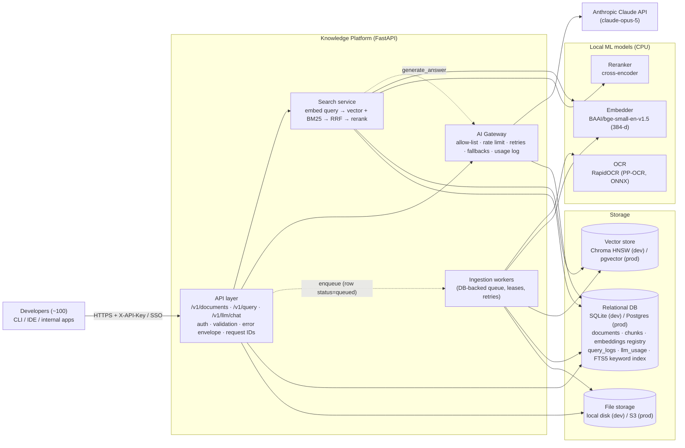
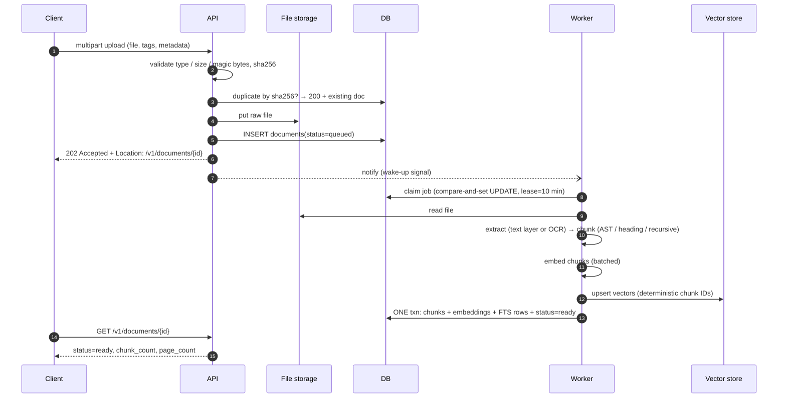
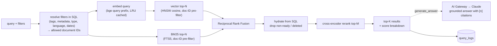

# System Architecture

## 1. High-level view

The relational DB is the **source of truth**. The vector store is a **derived index** that
can always be rebuilt from `chunks`. This one decision makes deletes, retries and
embedding-model migrations safe.

## 2. Ingestion flow (`POST /v1/documents`)

Failure handling in the worker:

| Failure | Behaviour |
|---|---|
| Unsupported or empty or corrupt file, no extractable text | `failed` right away with a readable `error` (retrying can't help) |
| Transient error (embedding OOM, vector store down, DB locked) | `attempts += 1`, re-queued with exponential backoff; `failed` after `KP_MAX_INGEST_ATTEMPTS` |
| Worker crash mid-job | Lease (`locked_until`) expires and another worker re-claims the job. Nothing is lost on restart |
| Crash after vectors were written but before the SQL commit | Retry upserts the same deterministic IDs. Orphan vectors are never served, because query results are hydrated from SQL and filtered to `status=ready` |
| Document deleted while it is being processed | The final transaction re-checks status, discards the vectors it wrote, and leaves the purge to the delete path |

## 3. Query flow (`POST /v1/query`)

## 4. Delete flow (`DELETE /v1/documents/{id}`)

1. **Soft delete** (synchronous, one atomic UPDATE): `status=deleted`, `deleted_at=now`.
   From this moment, the document is invisible to every query and listing, because all
   read paths filter on `status`.
2. **Hard purge** (async, or inline with `?hard=true`): delete vectors → one SQL
   transaction deleting FTS rows, embeddings, chunks, tags and the document row → delete
   the raw file.
3. **Partial failure**: every purge step is idempotent. If the vector store is down, the
   document stays soft-deleted (still invisible), `purge_attempts` is incremented, and the
   worker retries with exponential backoff. Documents that exhaust their retries appear in
   `/ready` as `purges_needing_attention` for an operator.

**Why both?** A soft delete alone leaves data behind: storage grows, and "delete" requests
(e.g. accidentally uploaded secrets or PII) must mean deleted. A synchronous hard delete
alone spans two systems (DB + vector store) with no shared transaction, so a failure
halfway leaves a document that is half-searchable. Soft-then-purge gives an **immediate,
atomic user-visible effect** and **eventually-complete physical removal** with retries.

## 5. AI Gateway

All LLM traffic goes through `app/gateway.py`, both the RAG answer step and the
developer-facing `POST /v1/llm/chat`:

- **Credentials**: the provider key lives only on the server. Developers use platform keys.
- **Model allow-list** (`KP_LLM_ALLOWED_MODELS`) and a default model (`claude-opus-5`).
- **Per-user rate limiting** (token bucket; 429 with `retry_after_s`).
- **Resilience**: SDK retries with backoff on 408/409/429/5xx, request timeout, and
  server-side refusal fallbacks (`fallbacks="default"`).
- **Accounting**: every call is written to `llm_usage` (user, model, tokens, latency,
  status) for cost attribution and auditing.
- **Graceful degradation**: if the LLM is unavailable, `/v1/query` still returns the
  retrieval results, with `answer.error` set.

## 6. Code map

| Path | Responsibility |
|---|---|
| `app/main.py` | App factory, lifespan (model warm-up, worker start/stop), request-ID middleware |
| `app/api/` | HTTP routers: documents, query, llm gateway, health |
| `app/ingestion/extractors.py` | PDF text layer + OCR fallback, header/footer stripping, text decoding |
| `app/ingestion/chunkers.py` | Recursive prose splitter, markdown-by-heading, Python AST chunker, generic code |
| `app/ingestion/pipeline.py` | Ingest + purge pipelines (consistency rules live here) |
| `app/worker.py` | DB-backed job queue: claiming, leases, retries, backoff |
| `app/retrieval/` | Search service (hybrid + RRF + rerank), BM25 index, reranker, caches |
| `app/embeddings.py`, `app/vectorstore.py` | Swappable embedding and vector-store interfaces |
| `app/gateway.py` | AI Gateway |
| `app/db/` | SQLAlchemy models and engine setup |
