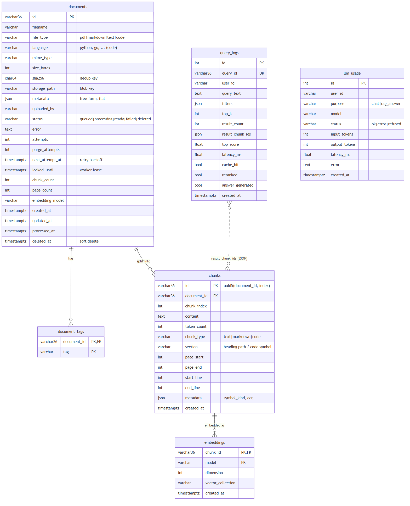

# Database Design

The relational database is the **system of record**: documents, chunks, tags, the
embeddings registry, query logs and LLM usage. Vectors live in a vector index derived
from `chunks`. Locally that's SQLite (WAL mode) + Chroma. For production, the same model
maps to **PostgreSQL + pgvector** (DDL below), so vectors and metadata share one
transactional store.

## ER diagram



<sub>Diagram source: [er_diagram.mmd](diagrams/er_diagram.mmd) (Mermaid)</sub>

Source: [app/db/models.py](../app/db/models.py). The keyword index is an FTS5 virtual
table `chunks_fts(content, chunk_id, document_id)` using the `porter unicode61` tokenizer.

## Production DDL (PostgreSQL + pgvector)

```sql
CREATE EXTENSION IF NOT EXISTS vector;

CREATE TABLE documents (
    id              uuid PRIMARY KEY,
    filename        text        NOT NULL,
    file_type       text        NOT NULL CHECK (file_type IN ('pdf','markdown','text','code')),
    language        text,
    mime_type       text,
    size_bytes      bigint      NOT NULL,
    sha256          char(64)    NOT NULL,
    storage_path    text        NOT NULL,            -- s3://bucket/<id>/<name>
    metadata        jsonb       NOT NULL DEFAULT '{}',
    uploaded_by     text        NOT NULL,
    status          text        NOT NULL DEFAULT 'queued',
    error           text,
    attempts        int         NOT NULL DEFAULT 0,
    purge_attempts  int         NOT NULL DEFAULT 0,
    next_attempt_at timestamptz,
    locked_until    timestamptz,
    chunk_count     int         NOT NULL DEFAULT 0,
    page_count      int,
    embedding_model text,
    created_at      timestamptz NOT NULL DEFAULT now(),
    updated_at      timestamptz NOT NULL DEFAULT now(),
    processed_at    timestamptz,
    deleted_at      timestamptz
);
-- queue polling: only the small set of actionable rows is indexed
CREATE INDEX ix_documents_jobs    ON documents (next_attempt_at) WHERE status IN ('queued','processing','deleted');
CREATE UNIQUE INDEX ux_documents_sha256_live ON documents (sha256) WHERE status NOT IN ('deleted','failed');
CREATE INDEX ix_documents_owner   ON documents (uploaded_by, created_at DESC);
CREATE INDEX ix_documents_type    ON documents (file_type, language) WHERE status = 'ready';
CREATE INDEX ix_documents_meta    ON documents USING gin (metadata jsonb_path_ops);

CREATE TABLE document_tags (
    document_id uuid REFERENCES documents(id) ON DELETE CASCADE,
    tag         text,
    PRIMARY KEY (document_id, tag)
);
CREATE INDEX ix_document_tags_tag ON document_tags (tag);

CREATE TABLE chunks (
    id           uuid PRIMARY KEY,                 -- uuid5(document_id, chunk_index)
    document_id  uuid NOT NULL REFERENCES documents(id) ON DELETE CASCADE,
    chunk_index  int  NOT NULL,
    content      text NOT NULL,
    token_count  int  NOT NULL,
    chunk_type   text NOT NULL,
    section      text,
    page_start   int, page_end int,
    start_line   int, end_line int,
    metadata     jsonb NOT NULL DEFAULT '{}',
    content_tsv  tsvector GENERATED ALWAYS AS (to_tsvector('english', content)) STORED,
    created_at   timestamptz NOT NULL DEFAULT now(),
    UNIQUE (document_id, chunk_index)
);
CREATE INDEX ix_chunks_tsv ON chunks USING gin (content_tsv);   -- BM25-style keyword leg

CREATE TABLE embeddings (
    chunk_id    uuid REFERENCES chunks(id) ON DELETE CASCADE,
    model       text,
    embedding   vector(384) NOT NULL,              -- bge-small-en-v1.5
    -- denormalized filter columns so the ANN scan can filter without a join
    document_id uuid NOT NULL,
    file_type   text NOT NULL,
    created_at  timestamptz NOT NULL DEFAULT now(),
    PRIMARY KEY (chunk_id, model)
);
CREATE INDEX ix_embeddings_hnsw ON embeddings
    USING hnsw (embedding vector_cosine_ops) WITH (m = 16, ef_construction = 64);
CREATE INDEX ix_embeddings_doc ON embeddings (document_id);

CREATE TABLE query_logs (
    id               bigserial,
    query_id         uuid NOT NULL,
    user_id          text NOT NULL,
    query_text       text NOT NULL,
    filters          jsonb,
    top_k            int  NOT NULL,
    result_count     int  NOT NULL,
    result_chunk_ids uuid[] NOT NULL,
    top_score        real,
    latency_ms       real NOT NULL,
    cache_hit        bool NOT NULL,
    reranked         bool NOT NULL,
    answer_generated bool NOT NULL,
    created_at       timestamptz NOT NULL DEFAULT now(),
    PRIMARY KEY (id, created_at)
) PARTITION BY RANGE (created_at);             -- monthly partitions, see below
CREATE INDEX ix_query_logs_user ON query_logs (user_id, created_at DESC);
```

## Indexing strategy

| Index | Serves |
|---|---|
| HNSW on `embeddings.embedding` (cosine) | ANN top-N vector search: sub-linear, ~99% recall at this size |
| GIN tsvector (Postgres) / FTS5 (SQLite) on `chunks.content` | Keyword leg of hybrid search: exact identifiers like `report_failure` |
| `documents (status, next_attempt_at)`, partial in Postgres | Worker polling touches only actionable rows, not the whole table |
| Partial unique `documents (sha256) WHERE live` | Content de-duplication, race-free at the DB level |
| `document_tags (tag)` | Tag filters (`tags: [...]`, any-of) |
| GIN `documents.metadata` | Arbitrary `metadata: {key: value}` filters |
| `documents (file_type, language) WHERE ready` | Type and language filters |
| `chunks (document_id, chunk_index)` unique | Ordered chunk listing, per-document delete |
| `query_logs (user_id, created_at)` / `(created_at)` | Per-user history, time-range analytics |

## Metadata modeling

- **Typed columns** for everything the platform itself reasons about: `file_type`,
  `language`, `status`, `uploaded_by`, `created_at`. These are indexable and validated.
- **Normalized `document_tags`** table instead of a JSON array: indexed any-of lookups,
  and portable across SQLite and Postgres.
- **`documents.metadata` JSON** for team-defined attributes (`team`, `repo`,
  `source`...), exact-match filterable. It stays flat and scalar-only so it can be
  indexed and validated.
- **Chunk-level metadata** (`section`, pages, line ranges, `symbol_kind`, `ocr`) lives on
  `chunks`, so results can be cited as `file.py L57-67 (DecayProxyRotator.report_failure)`
  or `report.pdf p.15`.
- **Filter push-down**: filters resolve to a document-ID allow-list in SQL, which is
  then passed into both retrievers (`where document_id IN (...)`). Filtering happens
  *before* top-N truncation, so a filter never silently empties a result page.

## Query patterns

| Pattern | Path |
|---|---|
| Semantic search (hot path) | filter → ANN top-N + keyword top-N → fuse → hydrate `chunks ⋈ documents WHERE status='ready'` by primary key → rerank |
| Status polling | `documents` by primary key |
| Browse / list | `documents WHERE status<>'deleted' ORDER BY created_at DESC LIMIT/OFFSET` (+ tag / type) |
| Worker claim | `SELECT id ... WHERE status='queued' AND next_attempt_at<=now LIMIT 1` then compare-and-set `UPDATE` |
| Delete / purge | `UPDATE status` (soft) → `DELETE ... WHERE document_id=?` (hard) |
| Analytics | `query_logs` by time range: zero-result queries, latency p95, top documents, per-user usage |

## Partitioning

- **query_logs / llm_usage**: append-only and time-series. Range-partition them by
  month. Retention is `DROP PARTITION` (instant, no vacuum). Old partitions can be
  exported to the warehouse / S3 as Parquet for analytics.
- **chunks / embeddings**: at ~100 developers (≈10⁴–10⁶ chunks) no partitioning is
  needed. A single HNSW index handles millions of 384-d vectors in RAM (~1.5 KB/vector
  → about 1.5 GB per 1 M). Past that, **hash-partition by `document_id`**. That keeps all
  of one document's chunks in one partition, so deletes and re-indexing touch one
  partition. Alternatively, move to a sharded vector DB (Qdrant/Milvus) with
  `document_id` as the shard key.
- **Multi-tenant option**: if teams need hard isolation, use one collection or partition
  per team, which also makes team-scoped search cheaper.

## Caching

| Cache | Key | TTL / invalidation |
|---|---|---|
| Query-embedding cache (LRU) | `(embedding_model, query)` | 24 h. Embeddings are deterministic, so it's safe to cache long |
| Search-result cache (LRU) | `(normalized query, filters, top_k, rerank, hybrid, corpus_version)` | 5 min, **plus** automatic invalidation. `corpus_version` is bumped on every ingest, delete or reindex, so a cached result can't include deleted content |
| Model weights | in-process singletons | loaded once at startup (warm-up), so the first query is fast |
| Raw files | blob storage, not the DB | n/a |

Both caches are in-process today. With several API replicas they move to **Redis** with
the same keys. `corpus_version` then becomes a Redis counter (`INCR` on write), so
invalidation stays correct across replicas.
